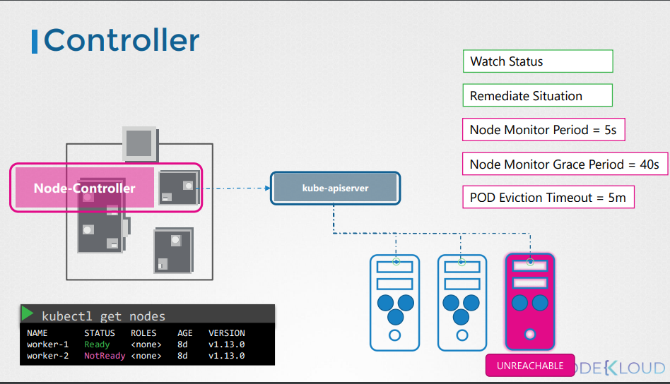

# Introduction to kubernetes
Kubernetes, also known as K8s, is an open source system for automating deployment, scaling, and management of containerized applications.
## Problem in Docker
1-No auto-scaling

2-No auto-healing

3-No Load-balance

4-No Enterprise

# why we need Kubernetes?
1-Auto-scalling

2-Auto-healing

3-Cluster management

4-Load-Balance

5-Rolling update&Rollback

# Kubernetes Architecture ?

1-Control Plane (Master Node)

2-Worker Nodes (Minions)
 # Control Plane Components 

 ## 1-API Server (kube-apiserver):

The API server is the front-end for the Kubernetes control plane. It exposes the Kubernetes API, serving as the central management entity for the entire cluster.

All interactions with the cluster, whether from the CLI, UI, or other tools, go through the API server.

## 2- etcd

etcd is a consistent and highly-available key-value store used as Kubernetes’ backing store for all cluster data.

It stores configuration data that can be accessed by all nodes in the cluster, ensuring data consistency.

## 3-Controller Manager (kube-controller-manager):

The controller manager runs controller processes to regulate the state of the cluster.

Controllers include node controllers, replication controllers, endpoints controllers, and others, which monitor the state of the cluster through the API server and make changes to ensure the desired state is maintained.

## 4-Scheduler (kube-scheduler):

The scheduler assigns work to the worker nodes. It watches for newly created pods that have no assigned node and selects a suitable node for them to run on.

The decision is based on factors such as resource availability, affinity/anti-affinity rules, and other scheduling policies.

# Worker Node Components 

## Kubelet:

The kubelet is an agent that runs on each worker node in the cluster. It ensures that containers are running in a pod.

The kubelet communicates with the API server to get instructions and reports back on the status of the node and the pods running on it.

## Kube-proxy:

Kube-proxy maintains network rules on each node. It allows network communication to your pods from network sessions inside or outside of the cluster.

It can perform simple TCP/UDP stream forwarding or round-robin TCP/UDP forwarding across backend services.

## Container Runtime:

The container runtime is the software responsible for running containers. Kubernetes supports various runtimes, including Docker, containerd, and CRI-O.

The runtime pulls container images from a registry, starts, and stops containers.

